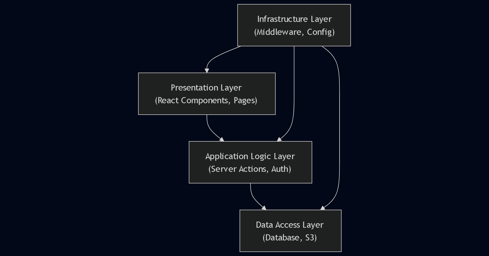

# Todo Application Report

## 📌 Project Overview

This project is a **Todo Application** built using modern web development technologies. It allows users to manage their personal task list efficiently with user authentication and optional image upload support.

---

## 🐦‍🔥Architecture Analysis of the Todo Application

Todo application uses a **layered architecture** as its primary architectural pattern, but it's enhanced with modern Next.js patterns and React paradigms. Here's the break down the architectural approach:

### Layered Architecture Components

The application follows a layered architecture with these distinct layers:

1. **Presentation Layer**

   - React components in `/components` directory
   - Next.js pages in `/app` directory
   - Handles UI rendering and user interactions

2. **Application/Business Logic Layer**

   - Server Actions in `/lib/actions.ts`
   - Authentication logic in `/auth.ts`
   - Handles business rules, data validation, and orchestration

3. **Data Access Layer**

   - Database connection in `/lib/db/index.ts`
   - Schema definitions in `/lib/db/schema.ts`
   - S3 integration in `/lib/s3.ts`
   - Handles data persistence and retrieval

4. **Infrastructure Layer**

   - Middleware in `/middleware.ts`
   - Environment configuration
   - Cross-cutting concerns like authentication and routing



## ✅ Features

1. **User Authentication**

   - Login and signup pages implemented under `/app/login` and `/app/register`.
   - Uses `next-auth` for session management.

2. **Todo List Display**

   - All todos are fetched from a relational database using Drizzle ORM.
   - Display logic handled inside the `components/ui/todo-list.tsx`.

3. **Add Todo Item**

   - Users can add new tasks via a form. If an image is uploaded, it is stored in an AWS S3 bucket.
   - The form is processed server-side using `addTodo()` function in `lib/actions.ts`.

4. **Update Todo Status**

   - Each todo can be updated (e.g., mark as "Done" or "In Progress").
   - Update logic interacts directly with the database using Drizzle.

5. **Delete Todo Item**

   - Users can delete todos. If the todo contains an image, it also deletes the image from S3 using `deleteFromS3()` in `lib/s3.ts`.

6. **(Optional) Image Upload**
   - Users can upload an image associated with a todo.
   - Image files are uploaded to an S3 bucket using the `uploadToS3()` function in `lib/s3.ts`.

---

## ⚙️ Framework & Tools

- **Frontend & Backend Framework**: [Next.js (App Router)](https://nextjs.org/)
- **CSS Styling**: Tailwind CSS
- **Authentication**: NextAuth.js
- **Database**: Neon (PostgreSQL)
- **Database ORM**: Drizzle ORM
- **Cloud Storage**: AWS S3 for optional image upload

---

## 🗄️ Database

The application uses **Neon PostgreSQL**, a scalable serverless PostgreSQL solution that integrates well with Next.js applications.

### 🧩 Database Schema

#### 1. `users` Table – Stores user information:

- `id` (primary key)
- `name`
- `email` (unique)
- `password` (hashed)
- `image` (optional)

#### 2. `todos` Table – Stores todo items:

- `id` (primary key)
- `content`
- `completed` (boolean)
- `imageUrl` (optional, for photo attachments)
- `createdAt` (timestamp)
- `userId` (foreign key → `users.id`)
- `status` (string)

---

### 🧪 ORM: Drizzle

For interacting with the database, the application uses **Drizzle ORM**, which offers:

- Type-safe database operations
- Clean and readable API for CRUD actions
- Excellent integration with TypeScript and modern frameworks like Next.js

## 🔗 GitHub Repository

> [GitHub Repo Link Here](https://github.com/GGWPXXXX/TodoListNa)

---

## 🚀 Running the Project Locally

Follow these steps to set up and run the Todo Application on your local machine.

### 1. Clone the Repository

```bash
git clone https://github.com/GGWPXXXX/TodoListNa
cd TodoListNa
```

### 2. Install Dependencies

```bash
pnpm install
```

### 3. Setup Environment Variables

Before continuing, make sure to:

1.  Create a Neon Postgres database at https://neon.tech and copy your database connection string.

2.  Create an AWS S3 bucket, and get your Access Key ID, Secret Access Key, and set your region (e.g., ap-southeast-2).

Create a .env file in the root directory and add the variables listed below. You can use the `.env.example` file as a reference.

```bash
DATABASE_URL=
NEXTAUTH_URL=
NEXTAUTH_SECRET=
AWS_ACCESS_KEY_ID=
AWS_SECRET_ACCESS_KEY=
AWS_REGION=
AWS_S3_BUCKET_NAME=
AWS_ENDPOINT=
```

### 4. Run Database Migrations

```bash
npx drizzle-kit push
```

### 5. Start the Development Server

```bash
pnpm dev
```

## 🚀 Application Deployment

### Vercel Deployment

- This app is deployed on **Vercel**.
- To deploy:
  1. Push your code to GitHub.
  2. Link the repo to Vercel.
  3. Add environment variables for:
     - `AWS_ACCESS_KEY_ID`
     - `AWS_SECRET_ACCESS_KEY`
     - `AWS_REGION`
     - `AWS_S3_BUCKET_NAME`
     - `AWS_ENDPOINT`
     - `NEXTAUTH_SECRET`
     - `NEXTAUTH_URL`
     - `DATABASE_URL`

---

## 🧠 Code Explanation & Design Decisions

### 📁 Project Structure

- `app/`

  - `login/` – Login page
  - `register/` – Signup page
  - `layout.tsx` – Global layout component

- `components/ui/`

  - `login-form.tsx` – Login form component
  - `register-form.tsx` – Registration form component
  - `todo-list.tsx` – Core display and control logic for todos
  - `theme-provider.tsx` – (Optional) Theme setup

- `lib/`

  - `actions.ts` – Handles DB logic and image upload/delete
  - `db/` – Drizzle schema & DB setup
  - `s3.ts` – AWS S3 integration

- `hooks/`

  - `use-mobile.tsx` – Custom mobile detection hook
  - `use-toast.ts` – Toast/notification hook

- `public/` – Static assets (e.g., icons, images)

- `.env` – Environment variables
- `.gitignore` – Git ignore rules
- `auth.ts` – Authentication setup (e.g., NextAuth)
- `drizzle.config.ts` – Drizzle ORM configuration

### 💡Highlights

- The image upload is optional and only triggered if a file is selected.
- `uploadToS3()` uses `@aws-sdk/lib-storage` to stream uploads directly.
- `deleteFromS3()` ensures image is removed if a todo is deleted.
- Each user’s image is stored in a folder matching their user ID for isolation.
- Image modal uses `fixed` and `flex` to center preview. Large vertical images are now scrollable for better UX.

---

```

```
